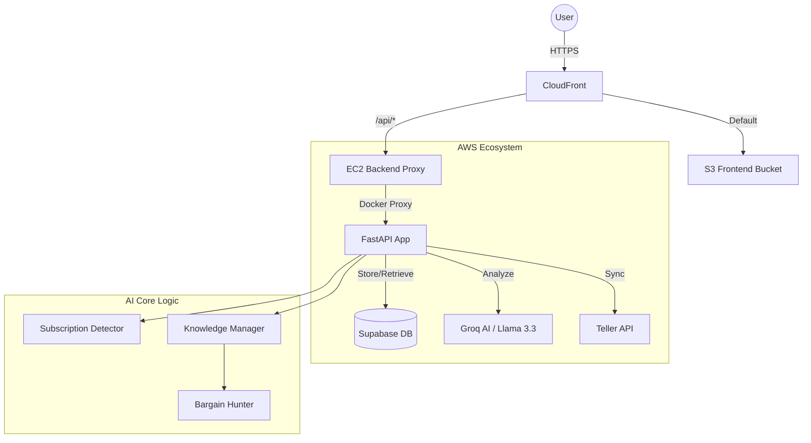

# ProjectSpara: Financial Intelligence & Savings Analyst

ProjectSpara is an AI-powered financial management platform designed to help users discover hidden subscriptions, research market benchmarks autonomously, and find cost-saving alternatives for their recurring expenses.

## 🏗️ Technical Architecture

### Service Interaction Flow
The following diagram illustrates how the frontend, backend, and AI components interact across the AWS infrastructure.



### **Detailed Component Interactions**

1.  **Request Routing**: All traffic enters via **CloudFront**.
    *   **Frontend**: Requests for static assets (HTML/JS/CSS) are served directly from the **S3 Bucket**.
    *   **Backend**: Requests matching `/api/*` are forwarded to the **EC2 Backend Origin**, where an **Nginx** reverse proxy routes it to the **FastAPI** container.
2.  **Autonomous Research (KM)**: When the **Bargain Hunter** detects a subscription in a new category, it triggers the **Knowledge Manager**. The KM uses **Groq AI** to research the market and saves fresh competitors/prices into the **Supabase** `market_benchmarks` table.
3.  **Savings Discovery (BH)**: The **Bargain Hunter** performs a cross-reference between your personal subscriptions and the AI-curated benchmarks in Supabase. It uses LLM logic to determine if a cheaper service is a "valid logical substitute" before presenting it to you.
4.  **Bank Synchronization (Teller)**: The backend securely communicates with the **Teller API** using mTLS certificates to pull real-time transaction data, which the **Detector** then analyzes to find your recurring payments.

## 🚀 Key Features

### 1. Subscription Detector
Uses **Llama 3.3** to analyze bank transaction patterns. It groups similar merchants, filters candidates with recurring dates, and uses AI to normalize names and categories (e.g., identifying "AMZN MKTP" as "Amazon Prime").

### 2. Autonomous Knowledge Manager
A background research engine that populates a "Market Benchmark" database. If a user has a subscription in a category that lacks data, the Knowledge Manager autonomously researches competitors and free alternatives across the web.

### 3. Bargain Hunter
Compares your active subscriptions against the AI-populated knowledge base. It provides personalized saving reports, such as suggesting "DaVinci Resolve" as a free alternative to "Adobe Premiere".

### 4. Supabase Keep-Alive
A specialized health-check system that pings the Supabase database during deployments and monitoring checks. This prevents the Supabase free-tier project from pausing due to inactivity.

## 🛠️ Tech Stack

- **Frontend**: Vite, React, Tailwind CSS, Lucide Icons, Recharts.
- **Backend**: FastAPI, Uvicorn, Docker, Nginx (Reverse Proxy).
- **Database**: Supabase (PostgreSQL).
- **AI/LLM**: Groq SDK (Llama 3.3 70B Versatile).
- **Infrastructure**: Terraform, AWS (S3, CloudFront, EC2, ECR).

## 📦 Deployment Details

### Infrastructure Setup (Terraform)
The infrastructure is managed via Terraform in the `terraform/` directory.

1. **Initialize & Apply**:
   ```bash
   cd terraform
   terraform init
   terraform apply
   ```
2. **Key Outputs**: Terraform will provide the `ec2_public_ip`, `cloudfront_domain_name`, and `s3_bucket_name`. These are required for the next steps.

### Environment Variable Mapping
Ensure these secrets are configured in your **GitHub Repository Settings > Secrets and variables > Actions**:

| Secret Key | Description |
| :--- | :--- |
| `AWS_ACCESS_KEY_ID` | AWS Credentials for Terraform and S3 Sync. |
| `AWS_SECRET_ACCESS_KEY` | AWS Credentials. |
| `EC2_HOST` | The public IP of your backend instance (output from Terraform). |
| `EC2_SSH_KEY` | Your private SSH key for deployment access. |
| `SUPABASE_URL` | Your Supabase project URL. |
| `SUPABASE_SERVICE_ROLE_KEY` | High-privilege key for backend database operations. |
| `GROQ_API_KEY` | API key for LLM analysis. |
| `VITE_API_URL` | Should point to your CloudFront domain (e.g., `https://dxxxxx.cloudfront.net`). |

### CI/CD Pipeline
- **Frontend Deployment**: Triggered by changes to `frontend/`. Builds the Vite app and syncs `.dist/` to S3, followed by a CloudFront invalidation.
- **Backend Deployment**: Triggered by changes to `backend/`. Builds a Docker image, pushes it to AWS ECR, and uses SSH to pull and restart the containers on EC2.

---

## 💻 Local Development

1. **Backend**:
   ```bash
   cd backend
   python -m venv venv
   source venv/bin/activate
   pip install -r requirements.txt
   uvicorn main:app --reload
   ```

2. **Frontend**:
   ```bash
   cd frontend
   npm install
   npm run dev
   ```
