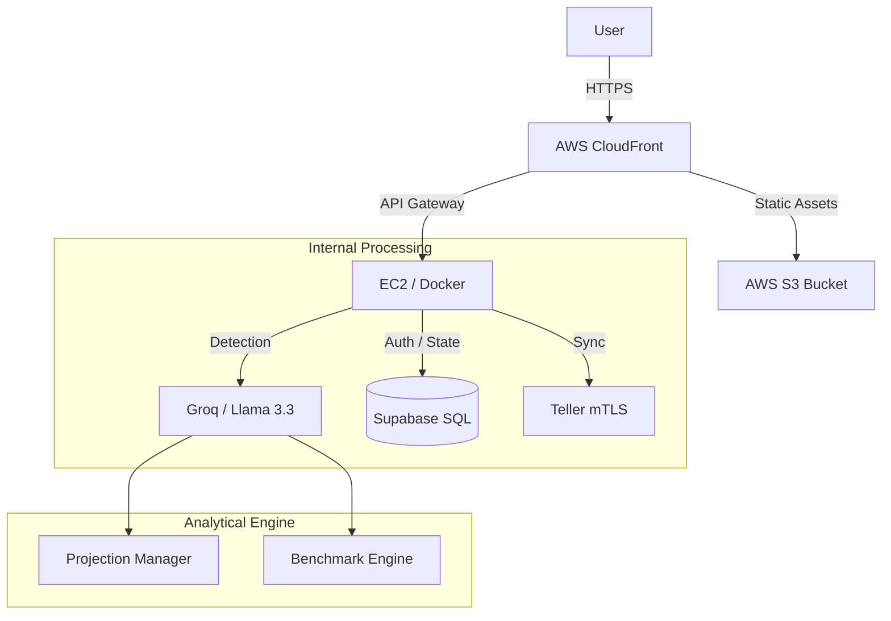
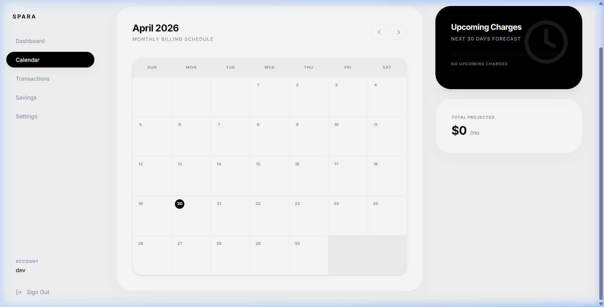
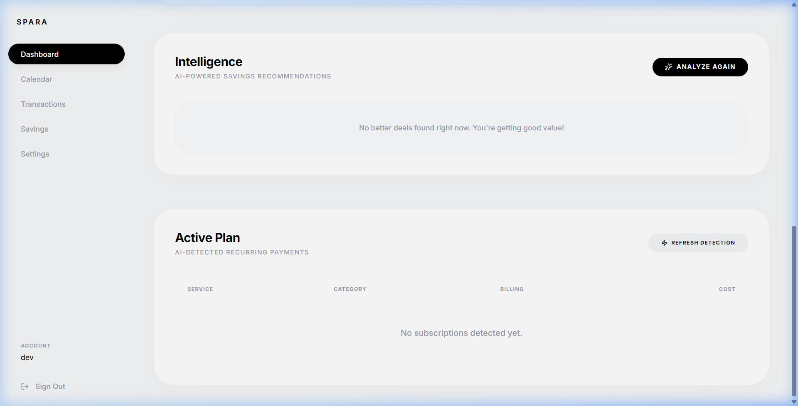

# ProjectSpara: Autonomous Financial Intelligence & Analytical Lifecycle Management

[](https://vitejs.dev/)
[](https://fastapi.tiangolo.com/)
[](https://supabase.com/)
[](LICENSE)
[](https://d3jv0c4kc01n7n.cloudfront.net/)

ProjectSpara is an advanced analytical platform designed for automated subscription lifecycle management and intelligent budget regulation. Utilizing Large Language Models (LLM) for pattern recognition and autonomous market research, it transforms raw transaction data into actionable financial guardrails.

Live Deployment: [https://d3jv0c4kc01n7n.cloudfront.net/](https://d3jv0c4kc01n7n.cloudfront.net/)

---

## Technical Architecture

The platform architecture is designed for high availability and secure data synchronization. It leverages mTLS for financial data ingestion and a multi-layered analytical pipeline for expenditure classification.



---

## Core Capabilities

### 1. Subscription Lifecycle Intelligence
ProjectSpara implements a heuristic detection engine that identifies recurring billing patterns across diversified transaction histories.
- Automated Detection: LLM-based categorization and merchant normalization (e.g., mapping complex merchant strings to canonical brand identities).
- Predictive Projections: Dynamic calculation of next-billing timestamps using historical frequency analysis and lookahead logic.



### 2. Guardrail-Based Budgeting
The platform provides a real-time spending regulation module that compares detected recurring liabilities against user-defined thresholds.
- Dynamic Progress Tracking: Real-time aggregation of monthly liabilities.
- Visual Variance Analysis: Color-coded budget integrity indicators (Safe, Warning, Critical).
- Inline Preference Management: Decoupled update logic for rapid guardrail adjustment.



### 3. Autonomous Market Research (Knowledge Manager)
A proprietary background service that populates market benchmarks without user intervention.
- Category Crawling: When new categories are detected, the system researched market-leading competitors and pricing tiers.
- Logical Substitutions: The AI identifies functional alternatives for high-cost subscriptions (e.g., suggesting open-source or free alternatives based on user utility).

---

## Technology Stack

- Frontend: React 19, TypeScript, Tailwind CSS (Vite build engine).
- Backend: FastAPI (Python 3.12+), Uvicorn ASGI.
- Data Architecture: PostgreSQL (Supabase) with Row-Level Security (RLS).
- AI Architecture: Groq Cloud (Llama 3.3 70B Versatile).
- Infrastructure: Terraform (IaC), AWS S3, CloudFront, ECR, EC2.

---

## Local Development Environment

### Prerequisites
- Python 3.12+
- Node.js 20+
- Supabase Project Credentials

### Backend Initialization
```bash
cd backend
python -m venv venv
# Windows
.\venv\Scripts\activate
# Unix
source venv/bin/activate
pip install -r requirements.txt
uvicorn main:app --reload --port 8000
```

### Frontend Initialization
```bash
cd frontend
npm install
npm run dev
```

---

## Security and Compliance

- Data Isolation: Row-Level Security (RLS) is strictly enforced on all database interactions.
- Credential Security: API keys and mTLS certificates are managed via encrypted environment variables.
- Connectivity: All financial data synchronization is performed over encrypted tunnels with industry-standard authentication.

---

## License

This project is licensed under the MIT License - see the LICENSE file for details.
